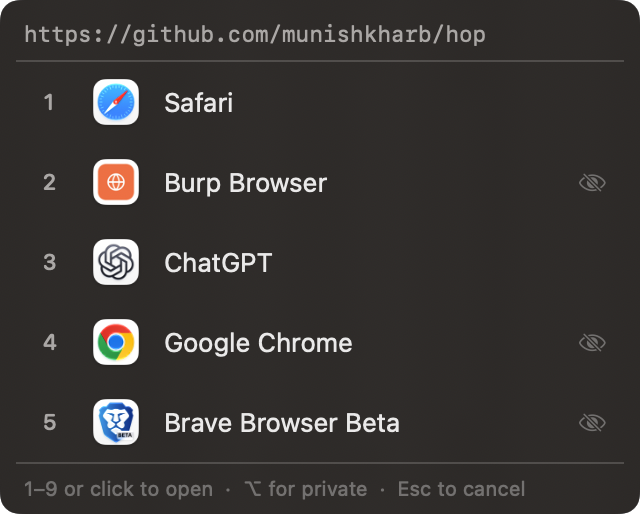

# hop

[](https://github.com/munishkharb/hop/actions/workflows/ci.yml)

A macOS browser picker. hop catches every link you open and either sends it straight to the right browser by your rules, or shows a fast picker so you choose in one keystroke.

<p align="center"></p>

- **Rules**: match a link by domain or path and send it straight to a chosen browser. Links with no matching rule go to the picker.
- **Picker**: a small panel at the pointer. Press 1–9 or click to open; hold ⌥ to open in a private window.
- **History**: see what opened where, and reopen recent links from the menu bar.
- **Velja import**: bring your existing Velja rules over.

## Keys

| In the picker | Does |
|---|---|
| `1`–`9` or click | Open the link in that browser |
| `⌥` + number or `⌥`-click | Open it in a private window (Chrome, Brave, Edge, Arc, Chromium, Firefox) |
| `Esc` or click away | Close the picker without opening anything |

## Install
Needs macOS 13 or later, on Apple silicon or Intel.

1. Download `Hop-<version>.dmg` from the [latest release](https://github.com/munishkharb/hop/releases/latest) and drag Hop into Applications.
2. hop is not notarized by Apple yet, so the first launch is blocked. Open it once, then go to System Settings → Privacy & Security and click **Open Anyway**. Or clear the download flag yourself: `xattr -dr com.apple.quarantine /Applications/Hop.app`.
3. Set hop as your default browser (hop's Settings → General has a button for it), and it takes over link handling.

Each release also carries a `.zip` of the app and `SHA256SUMS` for both files.

## Build
```
scripts/package.sh            # dist/Hop.app, Hop-<version>.dmg, Hop-<version>.zip
swift build -c release        # the bare binary only
```
Built with Swift and SwiftUI (SwiftPM executable target; needs Xcode 15+ for the SwiftUI macros). Pushing a `v*` tag runs `.github/workflows/release.yml`, which tests, packages and publishes the release.

## Development
Run `pre-commit install` once per clone. On every commit this then runs, against staged files:

- **betterleaks**: secrets scan (redacted output), blocks the commit on a hit. This is the main gate for this repo.
- **opengrep**: SAST against a small pinned rule pack vendored at `.opengrep/rules` (four Swift-specific rules, no registry fetch at commit time; secrets are covered by betterleaks). Opengrep's Swift coverage is thin, so treat it as a secondary check behind betterleaks.
- the standard pre-commit-hooks set: end-of-file-fixer, trailing-whitespace, check-merge-conflict, detect-private-key.

Both scanners run as already-installed binaries (`brew install betterleaks`; opengrep via its install script) rather than something pre-commit builds for you. Run everything on demand with `pre-commit run --all-files`. `main` is protected, so this file lands through a pull request rather than a direct push.

## License
MIT — see LICENSE.
